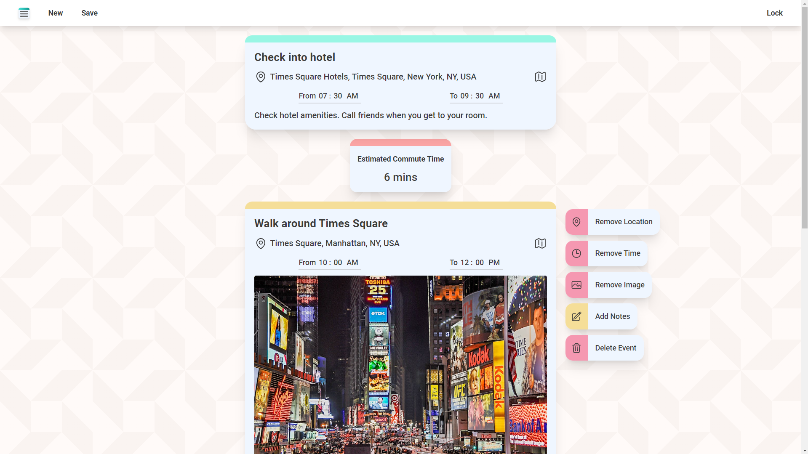
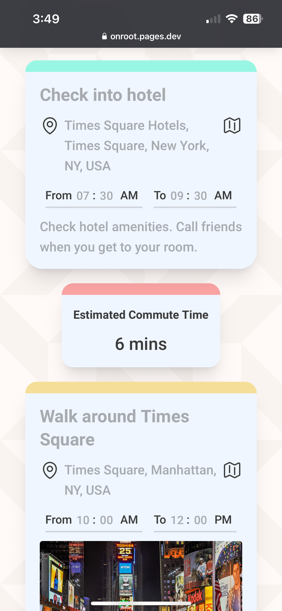
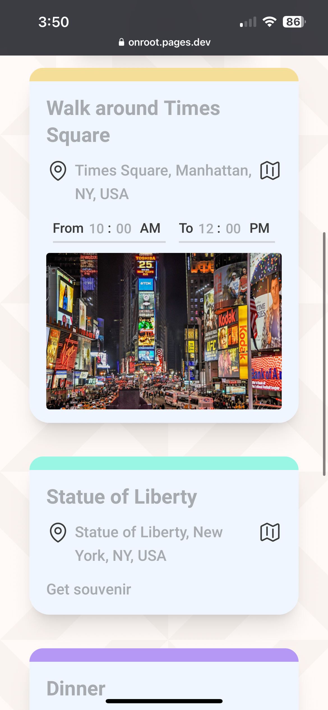
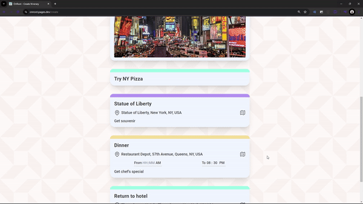

<h1 align="center">OnRoot 🗓️</h1>

<h4 align="center">Create card-based itineraries that you can share by URL or image.<a href="https://onroot.pages.dev/" alt="Website Link" style="text-decoration: none"> Try it yourself!</a> (Disclaimer: Google Maps API features have been disabled.)</h4>

    <a href="#preview" style="text-decoration: none"><b>Preview</b></a> •
    <a href="#technologies" style="text-decoration: none"><b>Technologies</b></a> •
    <a href="#contributors" style="text-decoration: none"><b>Contributors</b></a>

<h2 id="preview">🎴 Preview</h2>

<blockquote>Specify location and scheduling and get estimated commute time.</blockquote>

    
    

<blockquote>Mobile view.</blockquote>

<blockquote>Drag and drop cards to reorder them.</blockquote>

<h2 id="technologies">⚙️ Technologies</h2>
<ul>
<li><a href="https://angular.dev/" style="text-decoration: none"><b>Angular</b></a> - Frontend framework.</li>
<li><a href="https://tailwindcss.com/" style="text-decoration: none"><b>TailwindCSS</b></a> - CSS framework.</li>
<li><a href="https://developers.google.com/maps" style="text-decoration: none"><b>Google Maps Platform</b></a> - Route estimation and location search suggestions.</li>
</ul>

<h2 id="contributors">👥 Contributors</h2>

